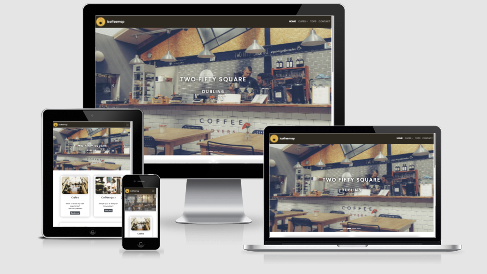
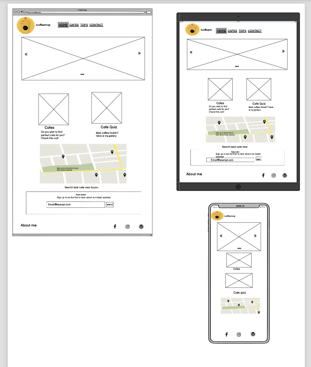
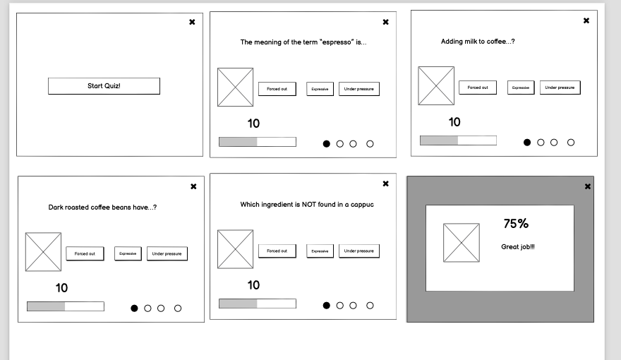
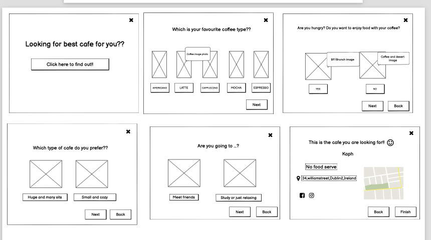
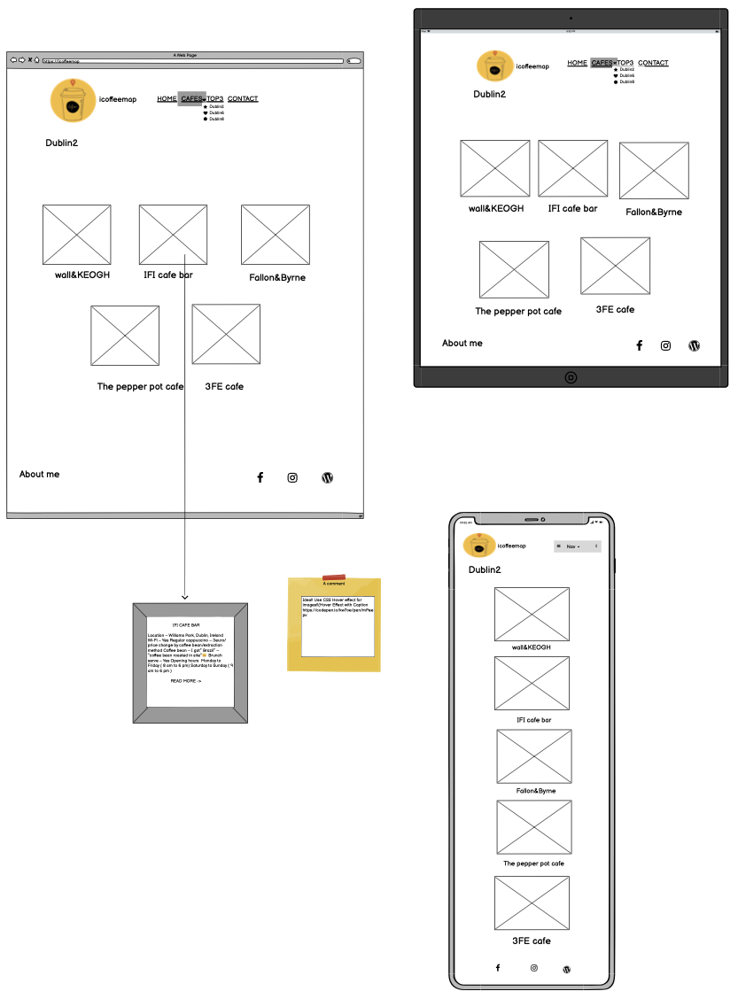
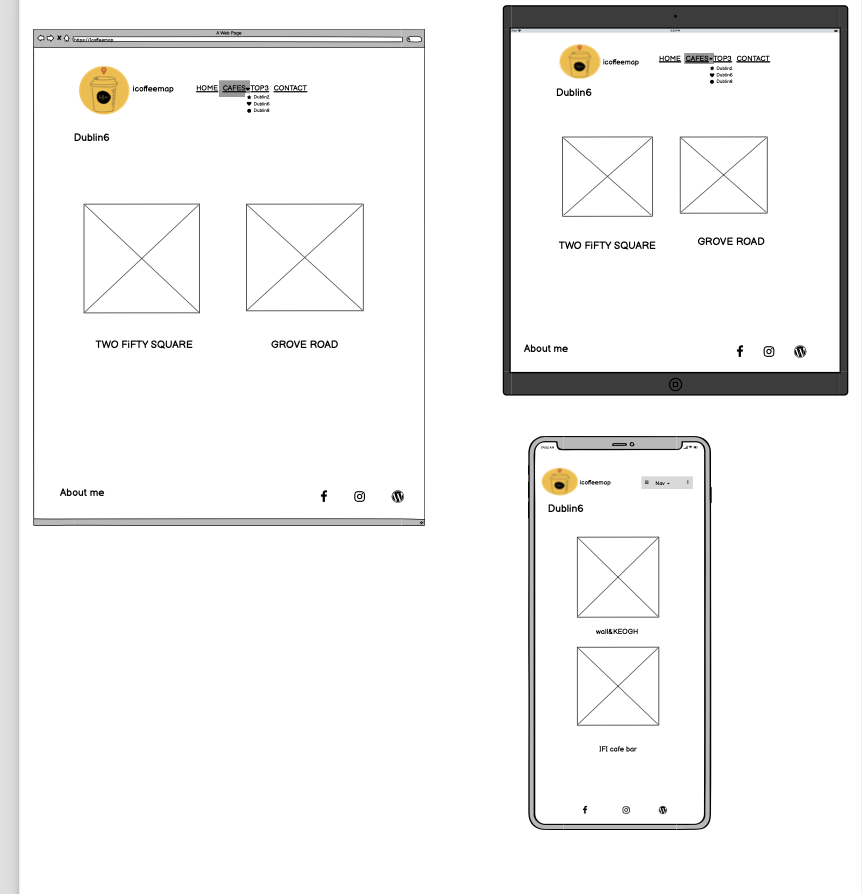
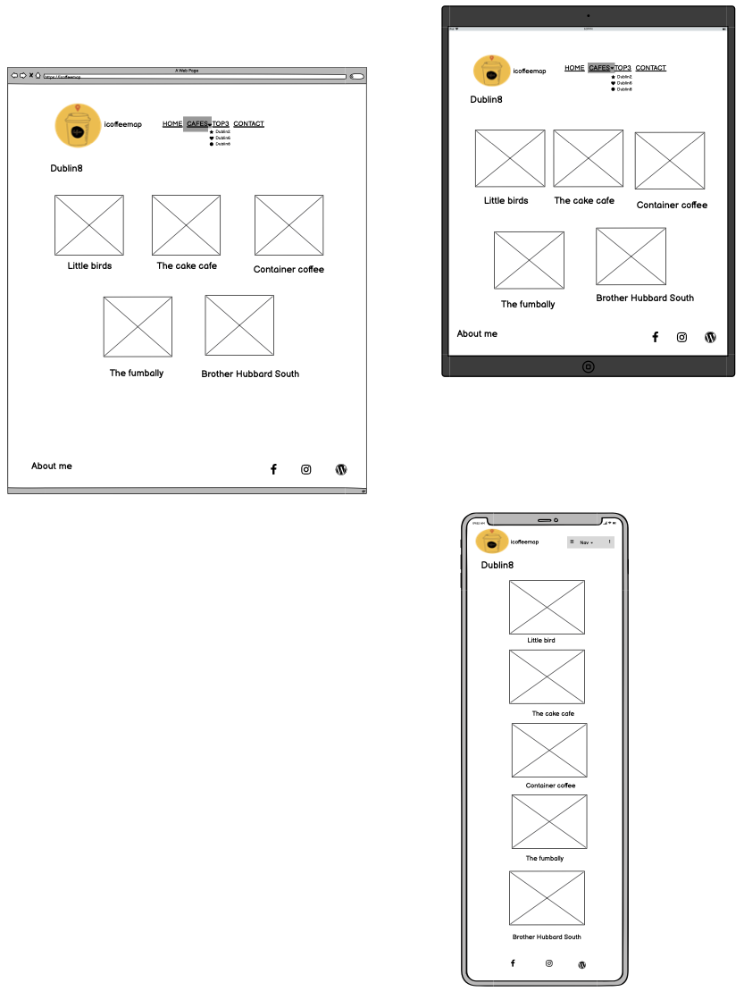
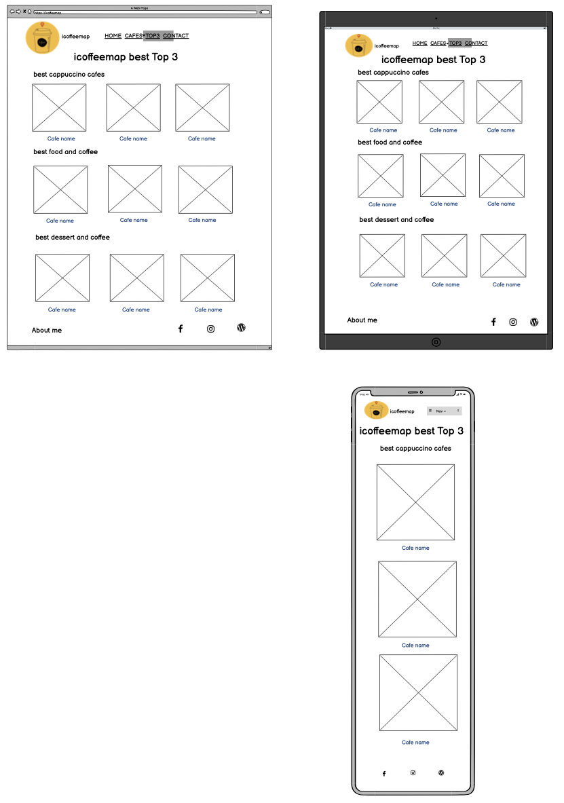
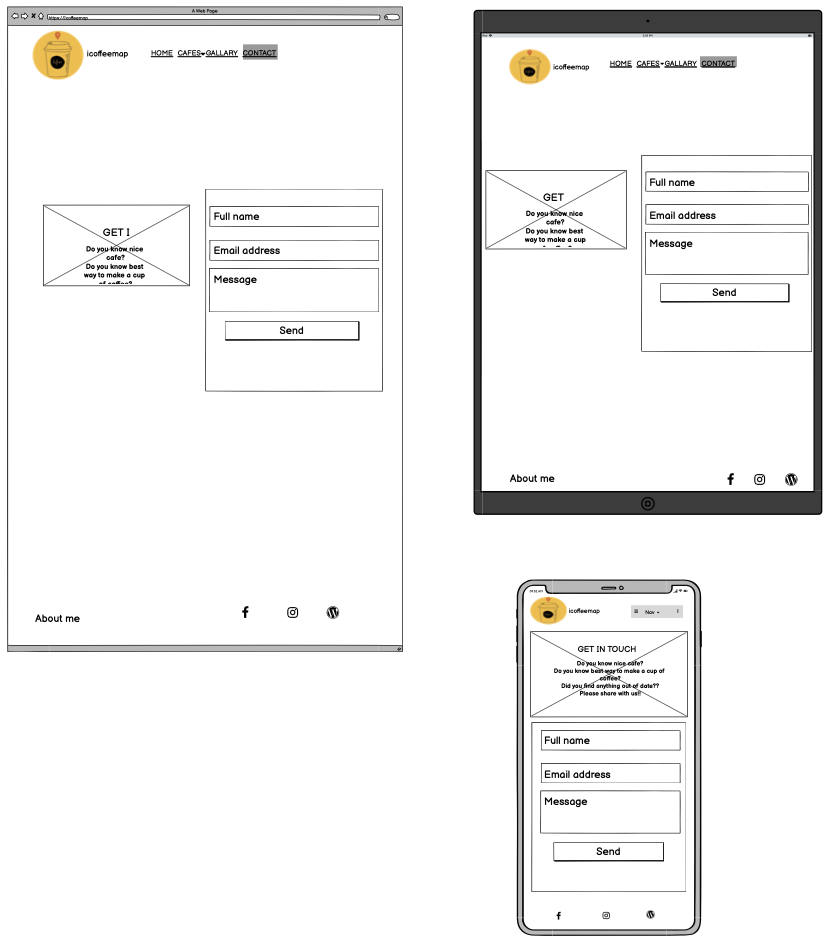

# icoffeemap

[View the live project here](https://oneday2010.github.io/milestone-project2/) 

### contents. 

<!-- after project finish, imag screenshot should be here with L/M/S size-->

---
---
## Table of contents
---

[Overview](#overview)

[Description](#description) 

[Ux](#ux) 

[Features](#features) 

[Technologies](#technologies) 

[Testing](#testing) 

[Deployment](#deployment) 

[Credits](#credits) 

## Overview
---
contents
## Description
---
contents

## UX
### User experience
---

### Strategy
---

 Main target user : client/user/visitor

contents
-  Business Goals

contents

 - User Stories

contents

### Scope
---

 - Requirements

 * client/user/visitor

comment

### structure
---

comment

### Skeleton
—
comment
 #### Wireframes
This website have four pages. The wireframes do not match with my final projext exactly, however, I can say almost as planed. 
 - Landing Page: welcoming page
 
  

 - comment

 

 - comment

  

 - comment
 
  

 - comment
  

 - comment
  

 - comment

  

 - comment
 
 

### Surface
—

comments 

 #### Design

  - Color Scheme : 

  - Typography : 

  -  Imagery : 

## Features
---
* ## Existing Features

comment
### navbar
comment 

### HOME
comment

### CAFES
comment

### TOP3
comment

### CONTACT
comment

### QUESTIONS
comment

### COFFEEQUIZ
comment

### Footer
comment

* ## Features left to implement

comment

 

## Technologies
### Technologies Used
---

* ### Languages Used
HTML5,CSS3,JAVASCRIPTS

* ### Frameworks,Libraries & Programs Used
1)[bootstrap4.5](https://getbootstrap.com/docs/4.5/getting-started/introduction/) -Bootstrap was used to assist with the responsiveness and styling of the website

2)[Hover.css](https://cdnjs.com/libraries/hover.css/2.1.1) - Hover.css was used on the Social Media icons in the footer to add the float transition while being hovered over. 

3)[Google Fonts](https://fonts.google.com/specimen/Oswald?preview.text_type=custom)
Google fonts use for most of headlines and paragraphs. 

4)[Font Awesome](https://fontawesome.com/)
Use bootstrap4/font awesome version. It used on all pages throughout the website to add icons 

5)[Balsamiq](https://balsamiq.com/wireframes/) - used to create the wireframe during the design process.

## Testing 
---
* ### Testing User Stories from User Experience (UX) section

 - Testing user story goal

comment

 - Forms testing: 

texting form data used the [link](https://www.emailjs.com)

 

 
 - Links : 

 - Testing across various devices ( I used Browser Stack as well as my one device and friends. the devices blows works without issue, however, I found some issue with very old version of device from BrowerStack such as iphone 5. I edit media queries, it worked better )
   * Android mobile: Galaxy s9
                     oneplus 8
                     pixel4
   * IOS mobile:iPhone 11, 6s,12,12pro
   * IOS table:ipad pro 2017 ,
   *  Android tablet : Samsung galaxy tob s6
   * laptop:macbook 13inch 2014

 - Ensured the website was also responsive on all the pages [Google Mobile Friendly Test](https://search.google.com/test/mobile-friendly?utm_source=gws&utm_medium=onebox&utm_campaign=suit) 
   - Home 
   - About 
   - Resume 
   - Contact
 
  - I tested on Safari,Chrome, Firefox it was performed without issue. 

 #### Validation
 - [W3C Markup Validator](https://validator.w3.org/) : 
 comments

  
 
 

#### project bug and solution

 comment

comment

  - comment

## Deployment
---
1)Firstly I create the account part of my CSS course on code institute. After practicing mini project, I could get idea to use Gitpod as well as GitHub. I created new repository to start my project and put name as “milestone-project1”

2)After get my own repository for my project I start work all coding and update all my files on Gitpod. 

3)Gitpod, a cloud-based version control software or IDE was used to write all code for this project. 

4)Each day when I done, I save the data and when all the work was done, I went to Github pages and check the setting menu and found the Github pages. I selected the Master Branch and it automatically create URL address. 

5)To access the code,, I can get clone which provides an URL and I can use my phone or any device, or download as zip file on the device.  - 

## Credits
---
* ### Content

Most of contents are original from myself. However, there are coding help from Code institute course User Centric Frontend Development -> resume-miniproject-bootstrap4. 
Especially "Work history"/"My Skill" from the course were great help.  I got many good idea from [w3school](https://www.w3schools.com/html/html5_semantic_elements.asp).

* ### Media

All the image files I got from "https://pixabay.com/"
there are three images I used this site
1) [Home background image]( https://pixabay.com/photos/laptop-desk-workspace-workplace-336373/)
2) [About girl](https://pixabay.com/illustrations/watercolor-portrait-character-girl-1020509/)
3) [Contact](https://pixabay.com/photos/student-typing-keyboard-text-woman-849822/)

* ### Acknowledgements

I received inspiration for this project from 

1) [Code institute](https://learn.codeinstitute.net/ci_program/diplomainsoftwaredevelopment)

User Centric Frontend Development-> mini project ( Resume)

2) Code institute->CSS Essentials->Love Running

3) Code institute->User Centric Frontend Development->Bootstrap4->Whiskey Drop 

4) I got great help from elerel's [readme reference](https://github.com/elerel/ms1-go2snow/blob/master/README.md#overview)

5) My Mentor,Nishant Kumar, and many tutors(Jo,Alan,Scott,Tim) gave me great help throughout this project.
