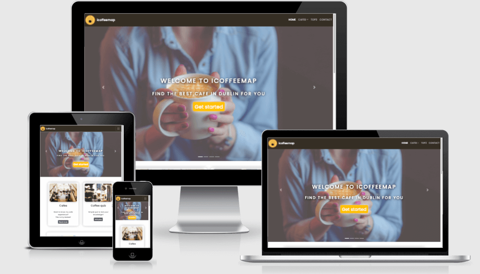
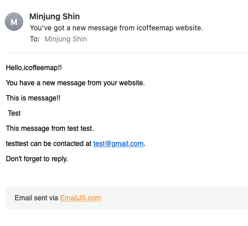

# icoffeemap

[View the live project here](https://oneday2010.github.io/milestone-project2/) 

The arm of this project was to create a user-friendly website which can help user to interact with contents and search the information easily about cafes located in Dublin. I am interested to find a nice cafe in Dublin and upload my reviews from my search to my blogs for years. I wanted to make a website to give better accessibility of the information and having more interaction with users. This website is targeted at a user who wants to find honest and detailed reviews about a cafe in Dublin. So it would help them get a better idea to decide which one would be the best suit for the user. This website is an offer to the user more customised and niche information for their need. 

---
---
## Table of contents
---

[Overview](#overview)

[Description](#description) 

[Ux](#ux) 

[Features](#features) 

[Technologies](#technologies) 

[Testing](#testing) 

[Deployment](#deployment) 

[Credits](#credits) 

## Overview
---

There are plenty of cafe reviews websites online and many of them provide good information. While there are many cafe reviews out there, and the aim of icoffetmap was all about creating a platform that keeps the visitor interested, wanting to play more with a small quiz and get more niched and customised information. Sometimes too much information can create chaos to make a decision and take more time also gives less reliability about information. Icoffetmap offer that easy and fast as well as more honest and detailed cafe reviews and information to a user. 

## Description
---

It is a specialist Dublin cafe review website that is intended to be accessible on all devices. My aim in this project was to make the website more interactive with user and easy to access all needed information from my cafe blog reviews. Also, try to make more modern looks and trendy layout to increase a positive user experience.

## UX

### User experience
---

### Strategy
---

 Main target user : cafe searcher/business owner/tourist/visiter

This cafe review website is aimed to attract all demographics with a keen interest in searching for a nice cafe in Dublin. Especially, the website purpose to make right visits experience on cafes base on information and reviews updated. It will also beneficial for local people as well as tourists too. Cafe review isn’t popular as restaurant review does. However, there is more demand on cafe business as the coffee Industry grew massively. Therefore, icoffeemap will give fresh idea and information not only for cafe visitor but also, cafe owners too as the website will offer a deeper review and customised information.  

####  Business Goals

 1. To gain an increase in website user interactive , create quiz and search form.

 2. To provide a professional , clear and easy to navigate website for any type of user, be it first time user as well

 3. Offer customise and niche cafe review information with unique style, better user experience with more interactive functions on website. 

 4. Main business goal will be increase website traffic as user’s cafe reviews tool. It will help local cafe business and visiter experience.  Moreover there are many potential offer can be created such as introduce new cafes, increase area as well as producing goods in related coffee.

#### User Stories

   * As first time user

      “ There are so many cafes in my area, I don’t have time and money to check all the place, I want to find the right cafe for me when I need to grab a nice cup of coffee”

      “ As a crazy coffee lover, I want to find the right cafe where serves  good coffee  and unique taste and new experience.”

      “ I don’t know about coffee but I love to have a nice brunch with my family on my weekend. I want to find a nice cafe with food and good space to enjoy my weekend.”

      “ Sometimes I want to have a nice treat for myself with a delicious dessert and nice coffee in cozy cafe nearby my place”

  * As Regular User:

     “ I know a good place for coffee, I want to try the best cafe for food and dessert too”

     “Due to Covid situation, I don’t go far from my area, I love to discover nice cafe around my area and experience  according to reviews”

     “ This recommended cafe list need to get updates in my area as there are new cafes open recently. As long as there are more cafes I can search I’ll return.”

     “ I love coffee and cafes but not sure I know about coffee well.”

### Scope
---

 - Useful - This website is useful to a user who searches niche and customises cafe review

 - Sellable - There are many potential fundable possibilities such as a partnership with other cafe reviews, introducing new cafe goods ( coffee beans/ cafe goods in one platform etc)

 - Buildable - Fits in with the level of my abilities, limited Javascript function but it can improve in future. 

 - Objective - find the best-desired cafe in a short time with deeper details

 - Functional - user can find the information from TOP3 pages as well as all the cafe image can give a certain idea of cafes, all the image linked with a detailed review. 

 - Non-Functional  - limited cafe listed, limited area. Can be improved with APIs (Google map, Tripadvisor) in future for more database. Search tool/dark mode would be a nice touch. 

 - Business Rules - Accurate review information is essential. However, it is dealing with personal review, information can be very objective. Make sure all the user aware that the review has come from objective opinion. 

 * Main target user : cafe searcher/business owner/tourist/visiter

### Structure
---

I decided to separate the website into four sections- the home page, cafes, top3, contact pages. Moreover, there are coffee quiz and search form to interact with the user. The navbar and footer (both fixed) allow the user to easily find ways to get in touch and each page is to show consistency throughout. Each page is designed to provide practical information, reliable linked and related real images and content enough to enable the user to know what the website provides. 

### Skeleton
---

The website is divided into the main four sections and an additional one each quiz&search form as well as three additional pages on cafe pages by Dublin2, Dublin6, Dublin8. Most of the contents are a match my framework, however, I made much change throughout the project such as each pages layout and additional pages ( quiz and search form). I added an extra framework after. I replace top3page which originally a gallery page was. Try to avoid repeating the same information on a different page. 
 
 #### Wireframes

This website has eight pages. The wireframes do not match with my final project exactly, however, I can say almost as planned. 

 - Landing Page: welcoming page
 

 - Coffeequiz

 - Question ( to search and get result)

 - Dublin2 cafes
 

 - Dublin6 cafes

 - Dublin8 cafes

 - Top3 page

 - Contact
 

### Surface
—--

I wanted to keep consistent all the images and colour with a coffee image. Most of the images I took from the actual cafe which I reviewed, colour tones got inspired from Adobe [Adobe color](https://color.adobe.com/search?q=coffee) and [Colorspace](https://mycolor.space/?hex=%23352E24&sub=1) for colour match. Some illustration work on myself to match the colour tone with the website. Most of the containers and images got border shadows to look more 3D visual effect. 

 #### Design

   - Images : Each of the images were carefully selected to depict the scene and send an impression of realism as use actual cafe photos. Try to add extra brightness and contrast to make it attractive and light up the impression of the website overall. 

  - Color Scheme : I wanted to make the website as much as minimum colour but have consistency between all the colour combination. Mainly get many colour tone from coffee images and use two sites [color space](https://mycolor.space/?hex=%23352E24&sub=1) and [Adobe color](https://color.adobe.com/search?q=coffee) to get a better colour combination. The main colour tone is light brown for the container and footer. Dark brown and bright text on nav used to catch users eyes easily. 

 
    -- adobe color

 

  - Typography : I used Google Fonts to get some idea of my website fonts and decided to use “ ‘Poppins” and  “Sans-serif” as the backup font. I choose Poppins because it looks more followed trend as modern and minimalism at the same time it looks friendly and reliable. 

  - Icons : Font Awesome was my choice to use all icons on my website. I used mainly footer social icon, top3 page heading icons. Try to use icons that easy to understand the purpose of usage. 

## Features
---

### Navbar

 - There is a navbar fixed on the top of all the web pages to give the user better access and navigate the website easily. 

 - Use a dark background colour and bright text to catch the visitor’s eyes easily. On a mobile or tablet, the navbar is then collapsed to show the hamburger icon which expands when clicked to display the other pages. 

 - The user can click on the logo or navbar band to take the user back to the homepage. 

### Home

 - The top of the homepage, there is a slideshow used ‘ bootstrap4 carousel ’, use 4 different cafe images with welcoming text and real cafe image with cafe name on it.  Try to send a message that what this website is about. 

 - Under the slideshow, there are two images with short text that come with links. The first one is lined with my blog that contains all cafe reviews. And the second image linked to a simple coffee quiz that interacted with the user and increases interest in the website. 

 - Under the two image card, there is a map ( use google map API). Besides the map, there is a list of each cafes name written on the map. It also linked the review paged on my cafe review blog. 

 - Under the map, there is a newsletter form that invites the user to sign up to the icoffeemap’s newsletter. 

### cafes (Dublin 2,6,8)

 - when user clicks the Cafes it shows three option as Dublin2,6,8. When the user clicks the Dublin 2, the pages show 5 cafes reviews. There is a cafes image with a moving card contain a short review with a link button inside the image. Use card hover effect to give better motion on the pages. In Dublin 6, there are two cafe images and the same card hover effect. Same effect on Dublin 8 with 5 cafes image. Try to minimise the layout and appearance of pages to give a clear idea of the website and focus on user interaction with the card hover effect. 

### Top3

 - this page is the top3 suggestion for different category cafe.  Three cafes are ranked in my personal opinion.  The purpose of the page is that user can reduce the searching time, instantly decide what they look for. I use a simple hover effect when the mouse affects each row to give friendly interaction with the user.

### Contact

 - simple layout for the contact form contains with coffee image and the user can send full name and email address as well as message. The form will be sent to my email address ( I used [emailJS](www.emailjs.com) and when the user sent the form, the user will get the alert that they have sent the message. 

### Footer

 - footer allocated to the bottom of each page, So when the user finished scrolling down, they always expected to see the footer. Footer is contained about which linked the about page on my blog explain about the cafe review and beside the about, there are social media links. So they will help to get extra information about the website and user can find another way to communicate with icoffeemap website. 

## Existing Features
---

There are many existing cafe review website online. I wanted to create a website that simple and easy to find the info as well as having some fun with it too. My website has two big sections as functionally. One is to offer cafe information and recommend the cafes. The second is interacting with the user through coffee quiz and search form.  

### HOME

I already mentioned most of the existing feature above paragraph. Additionally, the navbar and footer help to navigate the whole website and with a media query, the website has better look and clear appearance. There are no about info shows on the footer on mobile size device. Its design gives a simple look for a small device. The same information can check on one of the image cards which is linked to my cafe review blog. 

### CAFES(Dublin 2,6,8 Pages)

same function as the home page about navbar and footer. Simple image card hovers effect with linked button in it. 

### TOP3

simple image card with the linked button on the bottom of the image. When the user moves mouse each row, not chosen image row get less opacity. In that way, the website can interact with the user. 

### CONTACT

Try that user get reacted after message sent. So, the user can be sure that it worked okay. 

### QUESTIONS

There are three questions with options to choose from. after the question, the user would get best-fit cafes from the choice made. There are cancel options all the form right corner and go next and back as well as finish function on them. 

### COFFEEQUIZ

There are four quizzes with timer function and progress bar and shows the correct answer with green colour and orange colour with the wrong answer. End of the quiz gets the percentage of quiz answer result with friendly image and comments. 

## Features left to implement
---

 - Many functions can be improved. For instance, it would be better that there is a search bar on the right corner of the navbar, so user can easily search regardless of cafe name or location. 

 - As an increase in popularity and user traffic, it would be a good idea to put dark mode that user can easier read on their device.

 - More cafe lists need to update and the exiting cafe review list should be up-to-date information to be served as possible as accurate information.

 

## Technologies

### Technologies Used
---

### Languages Used

## HTML5, CSS3, JAVASCRIPT

### Frameworks,Libraries & Service sites

1) [bootstrap4.5](https://getbootstrap.com/docs/4.5/getting-started/introduction/) -Bootstrap was used to assist with the responsiveness and styling of the website

2) [Hover.css](https://cdnjs.com/libraries/hover.css/2.1.1) - Hover.css was used on the Social Media icons in the footer to add the float transition while being hovered over. 

3) [Google Fonts](https://fonts.google.com/specimen/Oswald?preview.text_type=custom) - Google fonts use for most headlines and paragraphs. 

4) [Font Awesome](https://fontawesome.com/) - Use bootstrap4/font-awesome version. It used on all pages throughout the website to add icons 

5) [Balsamiq](https://balsamiq.com/wireframes/) - used to create the wireframe during the design process.

6) [JQuery](https://jquery.com/) - used javascript fuctions)

7) [google map API keys](https://developers.google.com/maps) - use my unique key to service google map view. 

   A Google Maps API key is a personal code provided by Google to access Google Maps on this site. my API key provides me with a free quota of Google Map queries. 

   I got google maps Javascript code from the google map platform and added my credit card to the billing account. I got my key information from google APIs & Service.

8) [emailjs.com](https://https://www.emailjs.com/) - EmailJS is a service that allows me to send emails directly from my client-side JavaScript code.

### Version control

  - [Github](https://github.com/) - Used to store the code and use of Github Pages to deploy the website.

  - [Gitpod](https://gitpod.io/workspaces) - Used as the primary version control IDE for developers to further push and commit code to Github.

### Other

 - [Code institute Course](https://learn.codeinstitute.net/ci_program/diplomainsoftwaredevelopment) - my primary source of leaning code.
 - [ChromeDevTools](https://developer.chrome.com/docs/devtools/)- Used eachtime when I check error/issue on my site.
 - [W3Schools](https://www.w3schools.com/js/default.asp) - often use for css and javascript code tips
 - [AmIResponsive](http://ami.responsivedesign.is/) - Used to check how the layout of the website looks across different devices.
 - [responsinator](http://www.responsinator.com/?url=https://oneday2010.github.io/milestone-project2/) - Used to test website layout on multiple devices
 - [Google Mobile Friendly Test](https://search.google.com/test/mobile-friendly) - Used to test all pages on a mobile device
 - [Adobe color](https://color.adobe.com/search?q=coffee) - Used to find right color pattern for my website
 - [Colorspace](https://mycolor.space/?hex=%23352E24&sub=1) - Used to find right color pattern for my website
 - [Youtube](https://www.youtube.com/) - Used to got javascript and css tip
 - [TinyJPG](https://tinyjpg.com/) - to compress image to better loading speed 
 - [Codepen site](https://codepen.io/) - Used to get tip for question and quiz form 

## Testing 
---

 - Forms testing: 
 
There are two sections to form the test. The first one is getting users information form such as ‘newsletter’ and ‘Contact’. Moreover, there are two quiz's form such as ‘Find your cafe( questions)’ and ‘coffee quiz’. To ensure the website was functioning as it should, I tested each of the forms on different devices and browsers. 

1. Newsletter
This form is asking the visitor to sign up for a new update by registering their email. There is an email input box and send button below. When user input their email address, I got the data through my email account which I register on ‘emailjs’ 

    texting form data used the [link](https://www.emailjs.com). Also, after the user submits the email, there are confirm popup on the window that confirmation message to the user that the data sent successfully. 

2. Contact
This form is required three sections to fill up to submit an optional message. When the user submits the info with submit button, the data come to my registered account and show a confirmed message on the windows popup. Texting form data used the [link](https://www.emailjs.com).

 
 
 
 
 

3. Find your cafe(questions)

User can find this form button on the home page inside the carousel. When the button clicked there is a new window open and one with a start button and three questions boxes and a result box at last. This form contains a close button on the right corner of each box and an options button with ‘Next’’Back’’Finish’ as a user can navigate the questions as to their desire. Credit to [this link](https://github.com/rudberga/CI-MS2-inspiry-tokyo).

Each button tested and all button works as it was designed for. Originally it supposed to pop up inside my home page. I made a separate page to do the question form. The reason is there are many functions on the home page includes a slideshow, coffee quiz and map etc. I want to more clear and less traffic on one page.

4.  Coffeequiz

This form is asking user four questions about coffee and shows the scoring base on the users have tested. There are thirteen buttons altogether. The first one with the start button and three option buttons each with four questions. I tested all and work. The quiz contained with timer and four counters with is working according to the code. The result shows with the percentage work with counters and the image and comments change according to the percentage. All works.  Credit to [this link](https://www.codeexplained.org/2018/10/create-multiple-choice-quiz-using-javascript.html)

 - Links : 
 Testing across various devices ( I used [responsinator](http://www.responsinator.com/?url=https://oneday2010.github.io/milestone-project2/) as well as my one device and friends. the devices blow works without issue

 - Mobiles/tablet/laptop
   * iPhone eXpensive portrait · width: 375px                 
   *  Android (Pixel 2) portrait · width: 412px
   * Android (Pixel 2) landscape · width: 684px
   * iPhone 6-8 Plump portrait · width: 414px
   * iPhone 11
   * iPad portrait · width: 768px:
   * MacBook 13inch 2014
   * MacBOOK 13inch 2019

 - Ensured the website was also responsive on all the pages [Google Mobile Friendly Test](https://search.google.com/test/mobile-friendly?utm_source=gws&utm_medium=onebox&utm_campaign=suit) 

   - Home 

   - Dublin 2  

   - Dublin 6 

   - Dublin 8  

   - Top3  

   - Contact 

   - Questions  mobileTest-questions.png)

   - Coffeequiz 
 
  - I tested on Safari,Chrome, Firefox it was performed without issue. 

 #### Validation
 - [W3C Markup Validator](https://validator.w3.org/) : 

 All pages have no issue found. same comments such as  blows image with all the pages

 

 - [W3C CSS Vaildator](https://jigsaw.w3.org/css-validator/) 

  All pages have no issue found. same comments such as  blows image with all the pages

 

#### Project bug and solution

  - bug1

          This bug occurred in mobile views. I couldn't figure out the margin issue with the footer. Which supposed to fixed on the centre in various mobile devices. I got help from tutor and media query I rid of pull-right from CSS style and add margin 10 auto to make the centre. The bug fixed.

  - bug2
  
  

         This bug occurred on tablet view. I add min-width 250 and with a media query, I add another CSS to be min-width 200, also adjusted margin size. it got fixed

  - bug3 

  

         On question.js, the suggested (model4) kept shows on the bottom of the question, I realized that I made mistake in spelling (model-split->modal-split). Fixed.

  - bug4

  

          On question.js, the function didn't work and it shows an error and I realized that suggestions should be more option to fit the function requirement. Because there are only 12 objects, some of the options doesn't fit with a suggestion. I add more cafes on suggestions, so the function has more flexibility to run. 

  - bug5

          All the images had big size, which delayed loading time. My mentor advised me to compress all the image size. I used [this site]((https://tinyjpg.com/)) to compress all the images and test on my old laptop. it loads faster than before.

 
  
### Testing User Stories from User Experience (UX) section

 #### Testing user story goal

  * ##### As as First Time User:

            “ There are so many cafes in my area, I don’t have time and money to check all the place, I want to find the right cafe for me when I need to grab a nice cup of coffee”

                        -> I just want to know the nearest located cafe from my place and this website helps me to find very easily"

            “ As a crazy coffee lover, I want to find the right cafe where serves  good coffee  and unique taste and new experience.”

                        -> there is find your cafe search tool help me to find the best place for me

            “ I don’t know about coffee but I love to have a nice brunch with my family on my weekend. I want to find a nice cafe with food and good space to enjoy my weekend.”

                        -> I check the few cafes near my place and few of cafes serve food and many sit there, I think I found the perfect cafe for me

            “Sometimes I want to have a nice treat for myself with a delicious dessert and nice coffee in cozy cafe nearby my place”

                        -> living in Dublin8, I found a nice dessert place from the list

            * ##### As Regular User:

            “ I know a good place for coffee, I want to try the best cafe for food and dessert too”

                        -> Top3 pages help me to challenge myself to try food and dessert in a cafe far from my place too

            “Due to Covid situation, I don’t go far from my area, I love to discover nice cafe around my area and experience  according to reviews”

                        -> I discovered some cafe hidden in my area, it was a great experience. 

            “ This recommended cafe list need to get updates in my area as there are new cafes open recently. As long as there are more cafes I can search I’ll return.”

                         -> I tried most of the cafes around my area, I loved to try other cafes according to the top3

            “ I love coffee and cafes but not sure I know about coffee well.”

                        -> coffee quiz was interesting, I didn't know what milk does for coffee, it was a great quiz to get some knowledge about coffee

## Deployment
---
    1)Firstly I create the account part of my CSS course on code institute. After practising the mini-project, I could get the idea to use Gitpod as well as GitHub. I created a new repository to start my project and put the name  “milestone-project1”

    2)After getting my repository for my project I start work all coding and update all my files on Gitpod. 

    3)Gitpod, a cloud-based version control software or IDE was used to write all code for this project. 

    4)Each day when I finished, I save the data and when all the work was done, I went to Github pages and check the setting menu and found the Github pages. I selected the Master Branch and it automatically creates a URL address. 

    5)To access the code, I can get a clone that provides an URL and I can use my phone or any device, or download it as a zip file on the device. 

## Credits
---
* ### Content

    1) Most of the contents from my original [cafe blog](https://mindfulmapping.wordpress.com/)

    2) For the carousel I got huge help from [bootstrap](https://getbootstrap.com/docs/4.0/components/carousel/)

    3) for the map and email javascript code got help from [codeinstitute](https://learn.codeinstitute.net/courses/course-v1:CodeInstitute+IFD101+2017_T3/courseware/03d3f6524ad249d9b33e3336d156dfd0/3b2af8636ea54a4d9dc45126f7498633/) / 
    [codeinstitute](https://learn.codeinstitute.net/courses/course-v1:CodeInstitute+IFD101+2017_T3/courseware/03d3f6524ad249d9b33e3336d156dfd0/e4710f80cdf34bffbd607bc102482d5c/)
    
    4) For Find the cafe questions form got help from [rudgerga](https://github.com/rudberga/CI-MS2-inspiry-tokyo) / [codepen](https://codepen.io/Ayn_/pen/vmVKZV)
    
    5) For Coffee quiz form got help from [Youtube](https://youtu.be/49pYIMygIcU) / [Code Explained](https://www.codeexplained.org/2018/10/create-multiple-choice-quiz-using-javascript.html)
    
    6) most of the card's effect got the idea from [codepen](https://codepen.io/kw7oe/pen/mPeepv)
    
    7) coffee quiz questions got the idea from [BuzzFeed](https://www.buzzfeed.com/jasminsuknanan/coffee-knowledge-quiz) and [welovequizzes](https://www.welovequizzes.com/coffee-quiz-questions-and-answers/)

    8) Grammar and spelling checked from [Grammarly](www.grammarly.com/)

* ### Media

  most of the cafe images originate from me. and there are images I used I referenced below (Pixabay)

    1) [coffeeContact](https://pixabay.com/illustrations/coffee-cafe-cup-kitchen-restaurant-3179847/)
    2) logo created by myself I used this tool [logo](https://www.canva.com/design/DACVY478Beo/pnXH0TrN-rfMASjJTTaN2A/edit)
    3) [cafeimages-cafe](https://pixabay.com/photos/cafe-restaurant-bar-people-tables-768771/)
    4) [coffeehouse](https://pixabay.com/photos/coffeehouse-bar-shop-cafe-espresso-2600877/)
    5) [holdingcoffee](https://pixabay.com/photos/hands-coffee-hold-holding-1283917/)
    6) [pourover](https://pixabay.com/photos/coffee-brew-caffeine-coffee-making-984328/)
    7) [coffeequiz-americano,latte,capuccino...](https://pixabay.com/illustrations/coffee-varieties-vector-4996650/)
    8) [coffeeface](https://pixabay.com/illustrations/coffee-cup-mug-routine-2896942/)
    9) [breakfast](https://pixabay.com/photos/breakfast-food-dish-1246686/)
    10) [coffeecake](https://pixabay.com/photos/coffee-cup-beverage-cappuccino-2439999/)
    11) [cafewithchair](https://pixabay.com/illustrations/outdoor-table-and-chairs-4290642/)
    12) [manysits](https://pixabay.com/photos/people-restaurant-coffee-shop-2591838/)

* ### Acknowledgements

    I received inspiration for this project from 

    1) [Code institute](https://learn.codeinstitute.net/ci_program/diplomainsoftwaredevelopment)

    2) I got great help from elerel's [readme reference](https://github.com/elerel/ms1-go2snow/blob/master/README.md#overview)

    3) My mentor Nishant Kumar's support gives me great help and Thanks to my tutors. 